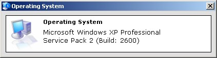

<div align="center">

## Get Operating System Version/Service Pack \(37 Flavors Supported; See List\)


</div>

### Description

This will obtain the Microsoft Windows version on the platform the program is executed on. It supports the newest versions too. Feedback is appreciated. Note that Blackcomb will change as it is just their code name for that Operating System.
 
### More Info
 


<span>             |<span>
---                |---
**Submitted On**   |2006-01-15 13:40:50
**By**             |[James Dougherty](https://github.com/Planet-Source-Code/PSCIndex/blob/master/ByAuthor/james-dougherty.md)
**Level**          |Intermediate
**User Rating**    |4.3 (13 globes from 3 users)
**Compatibility**  |VB 6\.0
**Category**       |[Miscellaneous](https://github.com/Planet-Source-Code/PSCIndex/blob/master/ByCategory/miscellaneous__1-1.md)
**World**          |[Visual Basic](https://github.com/Planet-Source-Code/PSCIndex/blob/master/ByWorld/visual-basic.md)
**Archive File**   |[Get\_Operat1965411152006\.zip](https://github.com/Planet-Source-Code/james-dougherty-get-operating-system-version-service-pack-37-flavors-supported-see-list__1-64046/archive/master.zip)

### API Declarations

```
Public Enum OSPLATFORM_PRODUCT
  OSPP_UNKNOWN = 0
  OSPP_WINDOWS_32S = 1
  OSPP_WINDOWS_95 = 2
  OSPP_WINDOWS_95_SP1 = 3
  OSPP_WINDOWS_95_OSR2 = 4
  OSPP_WINDOWS_95_OSR25 = 5
  OSPP_WINDOWS_98 = 6
  OSPP_WINDOWS_98_SP1 = 7
  OSPP_WINDOWS_98_SE = 8
  OSPP_WINDOWS_ME = 9
  OSPP_WINDOWS_2000 = 10
  OSPP_WINDOWS_2000_PROFESSIONAL = 11
  OSPP_WINDOWS_2000_SERVER = 12
  OSPP_WINDOWS_2000_SERVER_DATACENTER = 13
  OSPP_WINDOWS_2000_SERVER_ADVANCED = 14
  OSPP_WINDOWS_2003 = 15
  OSPP_WINDOWS_2003_R2 = 16
  OSPP_WINDOWS_2003_ENTERPRISE = 17
  OSPP_WINDOWS_2003_DATACENTER = 18
  OSPP_WINDOWS_2003_WEB = 19
  OSPP_WINDOWS_2003_X64 = 20
  OSPP_WINDOWS_2003_ENTERPRISE_X64 = 21
  OSPP_WINDOWS_2003_DATACENTER_X64 = 22
  OSPP_WINDOWS_2003_ENTERPRISE_ITANIUM = 23
  OSPP_WINDOWS_2003_DATACENTER_ITANIUM = 24
  OSPP_WINDOWS_XP = 25
  OSPP_WINDOWS_XP_X64 = 26
  OSPP_WINDOWS_XP_HOME = 27
  OSPP_WINDOWS_XP_PROFESSIONAL = 28
  OSPP_WINDOWS_NT = 29
  OSPP_WINDOWS_NT_351 = 30
  OSPP_WINDOWS_NT_400 = 31
  OSPP_WINDOWS_NT_400_WORKSTATION = 32
  OSPP_WINDOWS_NT_400_SERVER_ENTERPRISE = 33
  OSPP_WINDOWS_NT_400_SERVER = 34
  OSPP_WINDOWS_VISTA = 35
  OSPP_WINDOWS_SERVER_LONGHORN = 36
  OSPP_WINDOWS_BLACKCOMB = 37
End Enum
```


